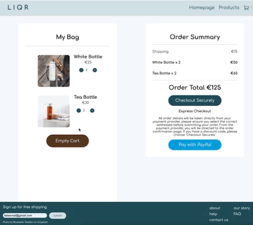
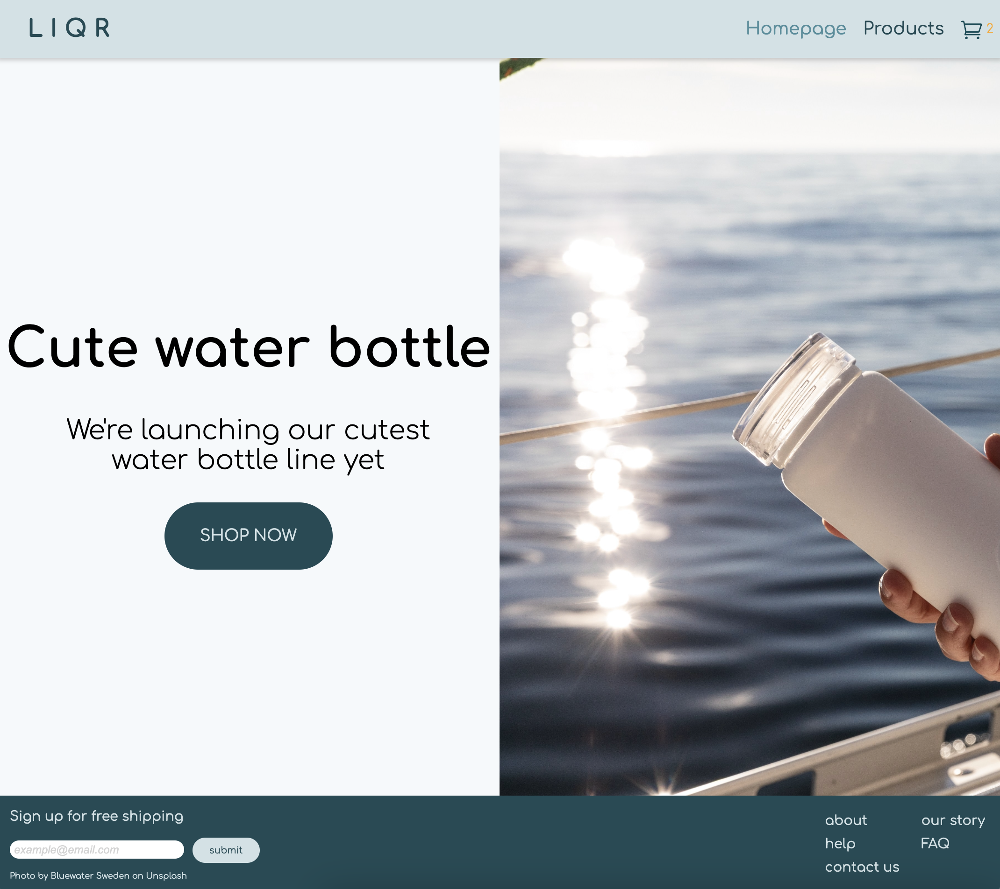
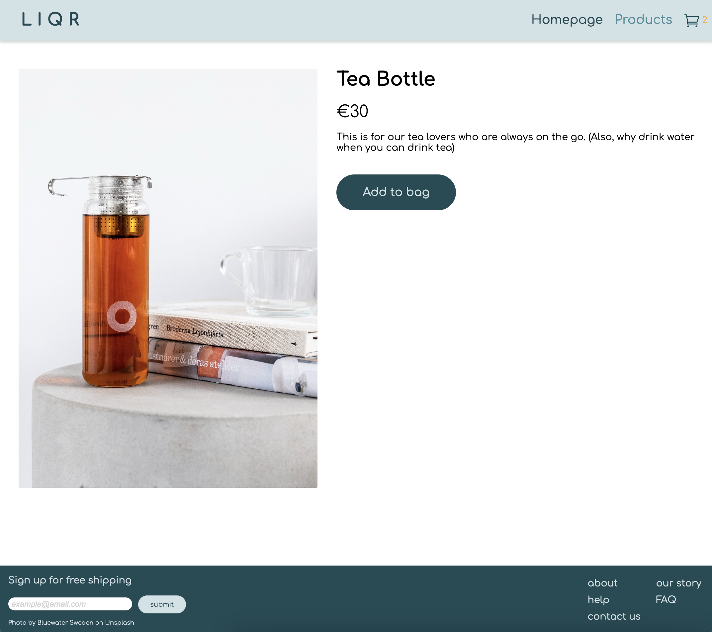
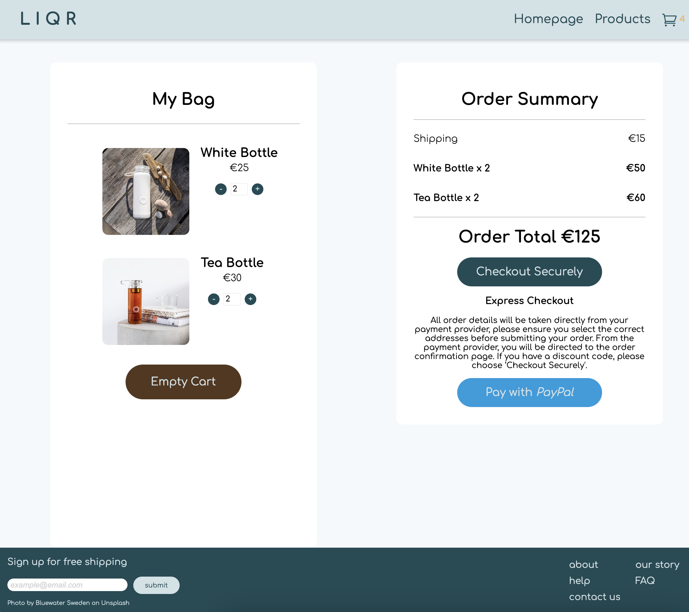
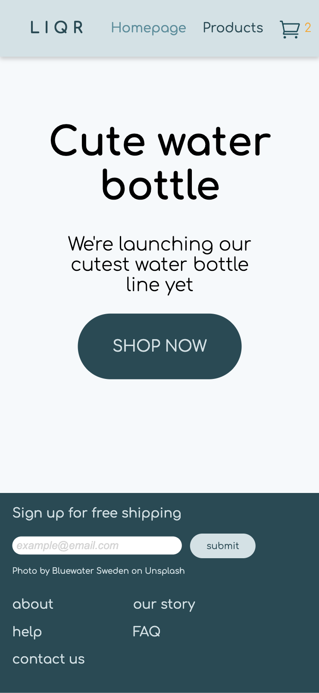
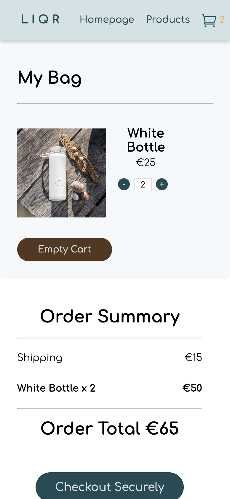
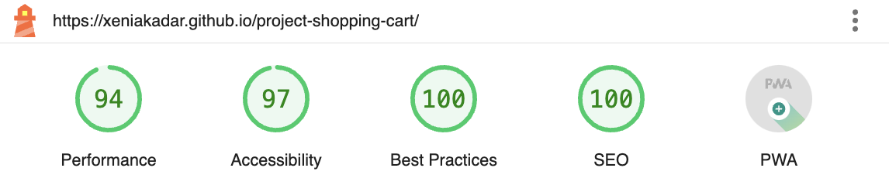

<h1>React E-Commerce Store - LIQR🚰</h1>

<h2>Short Description</h2>
An online store that "sells" water bottles, that was built using React. Each product has its own dedicated page and the checkout page makes it easy to add and remove items, while allowing the user to sign up for free shipping.

<h2>Demo</h2>
Checkout the <a href='https://xeniakadar.github.io/project-shopping-cart/' target="_blank">live demo</a>.

<h2>Showcase</h2>

The images and the GIF are a great illustration to how the page works - the user starts at the homepage and is directed to the products page. There, users can select products, add them to the cart and checkout once they're ready.

<h2>Performance</h2>

I used Google Lighthouse to run over my application to check its performance, accessibility, use of best practives and SEO opitimization.

<h2>Tech Stack</h2>
<ul>
<li>React</li>
<li>React Router Dom</li>
<li>CSS</li>
<li>Git</li>
</ul>

<h2>Credits</h2>
All rights to all pictures and products on this website belong to the respective publishers. This page is not being used commercially. If you are an owner of the copyrighted material, please let me know if you have any issues with this page and I'll take it down immediately.
